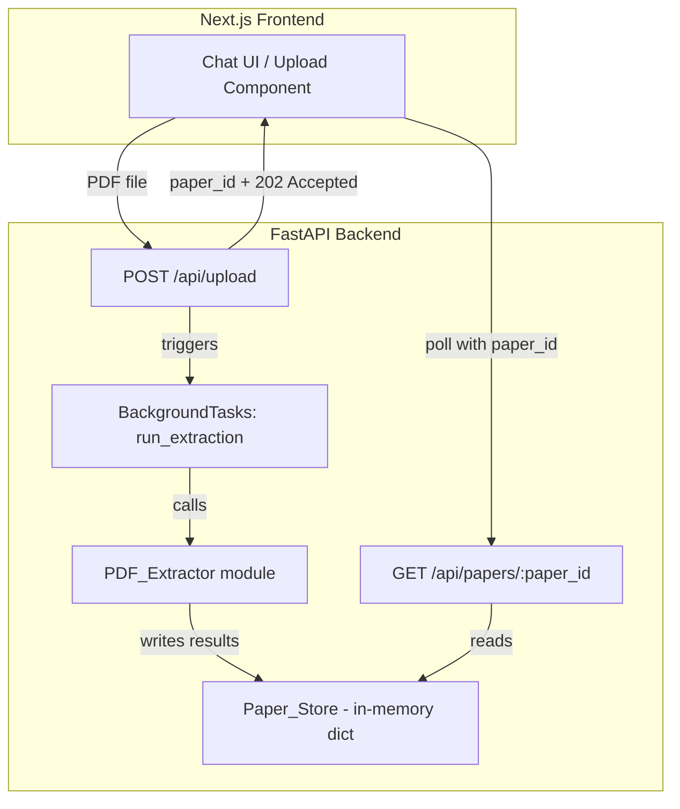

# Design Document: Academic Paper Critic

## Overview

The Academic Paper Critic feature provides a backend pipeline that accepts uploaded PDF academic papers, extracts structured data (metadata, content, research methods, visual assets), and stores results in-memory for retrieval. This is a hackathon MVP focused on simplicity — no database, no queues, no external AI calls in this extraction phase.

The system builds on the existing FastAPI backend and Next.js frontend. The current `/api/upload` endpoint is replaced with a more structured pipeline that generates a paper ID, validates the upload, runs extraction asynchronously, and exposes a retrieval endpoint.

### Key Design Decisions

1. **In-memory storage**: A Python dictionary keyed by UUID paper IDs. Acceptable for a hackathon demo with a single server process.
2. **Background extraction**: PDF extraction runs in a FastAPI `BackgroundTasks` handler so the upload response returns immediately with the paper ID.
3. **Single-module extractor**: All extraction logic (metadata, content, methods, visuals) lives in one `extractor.py` module with separate functions per extraction type.
4. **No AI in extraction**: This phase is pure PDF parsing. AI analysis is a separate future feature that consumes the extracted data.

## Architecture



### Request Flow

1. User uploads PDF via the frontend drag-and-drop area.
2. Frontend sends `POST /api/upload` with the file as multipart form data.
3. Backend validates the file (magic bytes, size, non-empty).
4. Backend generates a UUID v4 paper ID, stores raw bytes in `Paper_Store` with status `"extracting"`.
5. Backend enqueues extraction as a background task and returns `{ paper_id }` with HTTP 202.
6. Background task runs extraction functions sequentially: metadata → content → research methods → visual assets.
7. On completion, `Paper_Store` entry status is set to `"complete"`.
8. Frontend polls `GET /api/papers/{paper_id}` until status is `"complete"`, then displays results.

## Components and Interfaces

### Backend Components

#### 1. Upload Route (`app/routes/upload.py`)

Handles file reception, validation, and background task dispatch.

```python
# POST /api/upload
# Request: multipart/form-data with field "file"
# Response 202: { "paper_id": "<uuid4>" }
# Response 400: { "error": "<message>" }
```

**Validation rules:**
- File must be present and non-empty (> 0 bytes)
- File must start with `%PDF` magic bytes
- File size must be ≤ 20 MB

#### 2. Retrieval Route (`app/routes/papers.py`)

Returns extraction results for a given paper ID.

```python
# GET /api/papers/{paper_id}
# Response 200 (complete): { "paper_id", "status": "complete", "metadata", "content", "research_methods", "visual_assets" }
# Response 200 (in-progress): { "paper_id", "status": "extracting", "metadata": null, "content": null, ... }
# Response 404: { "error": "Paper not found" }
```

#### 3. Paper Store (`app/store.py`)

In-memory dictionary with thread-safe access.

```python
from threading import Lock
from typing import Any

_store: dict[str, dict[str, Any]] = {}
_lock = Lock()

def create_entry(paper_id: str, raw_bytes: bytes) -> None: ...
def get_entry(paper_id: str) -> dict[str, Any] | None: ...
def update_entry(paper_id: str, **fields) -> None: ...
```

#### 4. PDF Extractor (`app/extractor.py`)

Pure extraction logic, broken into focused functions.

```python
def extract_metadata(pdf_bytes: bytes) -> dict | None: ...
def extract_content(pdf_bytes: bytes) -> tuple[str | None, list[int]]: ...
def extract_research_methods(full_text: str) -> str | None: ...
def extract_visual_assets(pdf_bytes: bytes) -> list[dict]: ...
def run_extraction(paper_id: str) -> None: ...
```

### Frontend Components

The existing `page.tsx` chat UI already has file upload. The integration changes are:

1. On file upload, call `POST /api/upload` and store the returned `paper_id`.
2. Poll `GET /api/papers/{paper_id}` every 2 seconds until status is `"complete"`.
3. Display extraction status in the chat area.

No new frontend components are needed for this extraction phase — the existing UI handles it.

## Data Models

### Paper Store Entry

```typescript
// TypeScript representation (for frontend consumption)
interface PaperEntry {
  paper_id: string;              // UUID v4
  status: "extracting" | "complete";
  metadata: Metadata | null;
  content: string | null;
  skipped_pages: number[];       // pages where text extraction failed
  research_methods: string | null;
  visual_assets: VisualAsset[];
}

interface Metadata {
  title: string;                 // max 500 chars
  authors: string[];             // max 50 entries
  institutions: string[];        // max 50 entries
  journal: string | null;        // max 300 chars
  date: string | null;           // ISO 8601 "YYYY-MM-DD"
}

interface VisualAsset {
  page_number: number;           // 1-indexed
  width: number;                 // pixels
  height: number;                // pixels
  image_data: string;            // base64-encoded PNG
}
```

### Python Pydantic Models

```python
from pydantic import BaseModel, Field
from typing import Optional

class Metadata(BaseModel):
    title: str = Field(max_length=500)
    authors: list[str] = Field(max_length=50)
    institutions: list[str] = Field(max_length=50)
    journal: Optional[str] = Field(default=None, max_length=300)
    date: Optional[str] = None  # ISO 8601 YYYY-MM-DD or None

class VisualAsset(BaseModel):
    page_number: int  # 1-indexed
    width: int
    height: int
    image_data: str   # base64 PNG

class PaperEntry(BaseModel):
    paper_id: str
    status: str  # "extracting" | "complete"
    metadata: Optional[Metadata] = None
    content: Optional[str] = None
    skipped_pages: list[int] = []
    research_methods: Optional[str] = None
    visual_assets: list[VisualAsset] = []
```

## Correctness Properties

*A property is a characteristic or behavior that should hold true across all valid executions of a system — essentially, a formal statement about what the system should do. Properties serve as the bridge between human-readable specifications and machine-verifiable correctness guarantees.*

### Property 1: Upload returns unique valid UUID v4

*For any* sequence of valid PDF file uploads, every returned paper_id SHALL be a valid UUID v4 string, and all paper_ids across the sequence SHALL be distinct from one another.

**Validates: Requirements 1.1, 1.5**

### Property 2: Non-PDF bytes are rejected

*For any* byte sequence that does not begin with the PDF magic bytes (`%PDF`), uploading it SHALL result in a rejection error, and the Paper_Store SHALL remain unchanged.

**Validates: Requirements 1.3**

### Property 3: Oversized files are rejected

*For any* file larger than 20 MB (regardless of content), uploading it SHALL result in a rejection error indicating the size limit was exceeded, and the Paper_Store SHALL remain unchanged.

**Validates: Requirements 1.4**

### Property 4: Upload storage round-trip

*For any* valid PDF file that is accepted by the Upload_Service, the raw bytes stored in the Paper_Store under the returned paper_id SHALL be identical to the original uploaded bytes.

**Validates: Requirements 1.2**

### Property 5: Missing metadata fields default to null

*For any* PDF where a specific metadata field (title, authors, institutions, journal, date) cannot be identified, that field SHALL be set to null in the extracted Metadata object while other identifiable fields remain populated.

**Validates: Requirements 2.6**

### Property 6: Text extraction preserves page order with paragraph boundaries

*For any* multi-page PDF with extractable text, the Content string SHALL contain text from pages in sequential order (page 1 before page 2, etc.), concatenated as a single string with paragraph boundaries separated by double newline characters.

**Validates: Requirements 3.1, 3.2, 3.3**

### Property 7: Methods section detection is case-insensitive and extracts first match

*For any* document text containing a section heading matching one of the defined methods headings (regardless of letter case), the PDF_Extractor SHALL extract the text from that heading up to the next section heading of equal or higher level, and if multiple matches exist, only the first encountered section SHALL be returned.

**Validates: Requirements 4.1, 4.2, 4.3**

### Property 8: Visual assets are rendered with correct metadata and ordering

*For any* successfully rendered PDF page, the corresponding VisualAsset SHALL contain a 1-indexed page_number, positive width and height in pixels consistent with 150 DPI rendering, and a non-empty base64-encoded PNG string. The visual_assets list SHALL be ordered by ascending page_number.

**Validates: Requirements 5.1, 5.2, 5.3**

### Property 9: Non-existent paper ID returns not-found error

*For any* UUID string that does not correspond to an entry in the Paper_Store, requesting extraction results SHALL return a not-found error response.

**Validates: Requirements 6.2**

### Property 10: Response structure conforms to schema constraints

*For any* completed paper entry in the Paper_Store, the response SHALL contain all required top-level fields (paper_id, metadata, content, research_methods, visual_assets), and when metadata is non-null, title SHALL be ≤ 500 characters, authors SHALL have ≤ 50 entries, institutions SHALL have ≤ 50 entries, journal SHALL be ≤ 300 characters, and date SHALL match ISO 8601 "YYYY-MM-DD" format or be null.

**Validates: Requirements 7.1, 7.2**

## Error Handling

### Upload Errors

| Condition | HTTP Status | Error Message |
|-----------|-------------|---------------|
| No file or empty file | 400 | "A non-empty PDF file is required" |
| Invalid magic bytes | 400 | "Only PDF files are supported" |
| File > 20 MB | 400 | "File exceeds the 20 MB size limit" |

### Retrieval Errors

| Condition | HTTP Status | Response |
|-----------|-------------|----------|
| Paper ID not found | 404 | `{ "error": "Paper not found" }` |
| Extraction in progress | 200 | `{ "status": "extracting", ... null fields }` |

### Extraction Errors (Background Task)

Extraction errors are handled gracefully — they never crash the background task:

- **Metadata extraction fails entirely**: `metadata` set to `null`
- **Individual metadata field missing**: that field set to `null`, others populated
- **Text extraction fails for a page**: page skipped, page number added to `skipped_pages`
- **Text extraction fails for all pages**: `content` set to `null`
- **Methods section not found**: `research_methods` set to `null`
- **Page rendering fails**: page skipped, excluded from `visual_assets`
- **All page renders fail**: `visual_assets` set to empty list `[]`

The extraction function wraps each step in try/except so partial results are always stored.

## Testing Strategy

### Property-Based Testing

**Library**: [Hypothesis](https://hypothesis.readthedocs.io/) (Python)

Property-based tests validate universal correctness properties across generated inputs. Each property test runs a minimum of 100 iterations.

**Properties to implement:**
- Properties 1–4: Upload validation and storage (generate random byte sequences, valid/invalid PDFs)
- Property 5: Metadata null handling (generate PDFs with missing fields)
- Property 6: Text extraction ordering (generate synthetic multi-page PDFs)
- Property 7: Methods section detection (generate text with headings in random cases)
- Property 8: Visual asset rendering (generate multi-page PDFs, verify output structure)
- Property 9: Non-existent ID handling (generate random UUIDs)
- Property 10: Schema conformance (verify response structure after extraction)

**Tag format**: `# Feature: academic-paper-critic, Property {N}: {title}`

### Unit Tests (Example-Based)

Unit tests cover specific scenarios and edge cases that complement property tests:

- **Metadata extraction**: Test against 2–3 known academic PDFs with expected metadata values
- **Edge cases**: Empty file upload, zero-byte file, exactly 20 MB file (boundary)
- **In-progress state**: Verify status is "extracting" immediately after upload
- **Corrupted PDFs**: Files starting with %PDF but containing garbage after

### Integration Tests

- **Full pipeline**: Upload a real PDF, wait for extraction, verify all fields populated
- **Response time**: Verify retrieval completes within 2 seconds (Requirement 6.1)
- **Data retention**: Verify data persists across multiple retrieval calls

### Test Organization

```
backend/
  tests/
    test_upload_properties.py    # Property tests for upload validation (Props 1-4)
    test_extractor_properties.py # Property tests for extraction logic (Props 5-8)
    test_store_properties.py     # Property tests for store behavior (Props 9-10)
    test_upload.py               # Unit tests for upload edge cases
    test_extractor.py            # Unit tests for extraction with known PDFs
    test_integration.py          # End-to-end integration tests
```

